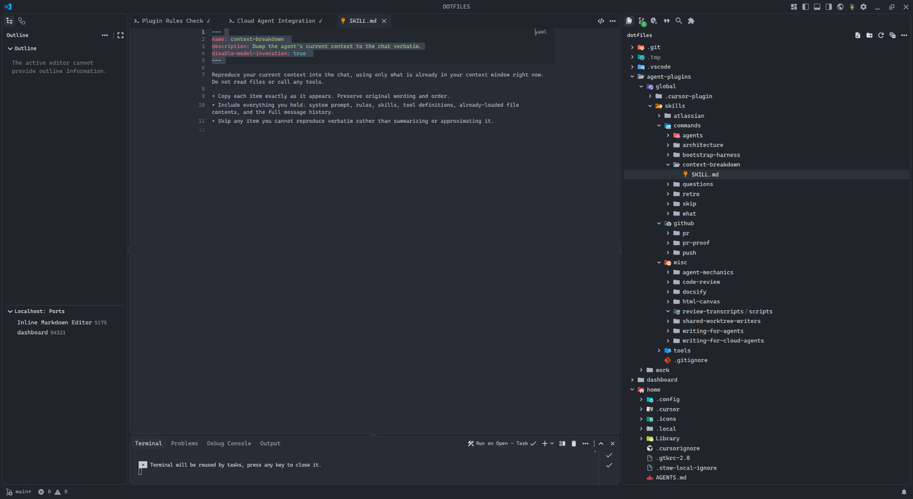

# Front matter selection jumps to YAML on the right instead of raw text on the left

## Description
When selecting text inside YAML front matter (between `---` delimiters), the selection highlight jumps to the right side of the editor over the rendered YAML UI instead of covering the raw source on the left. This breaks normal text selection and does not reveal or align with the raw front matter where the YAML content should appear on the left inside the `---` block.

## Steps
1. Open a Markdown file with YAML front matter (e.g. `SKILL.md` with `---`, `name:`, `description:`, `disable-model-invocation:`, closing `---`).
2. Select lines inside the front matter block (e.g. lines 2–4: `name`, `description`, `disable-model-invocation`).

## Expected
Selection should cover the raw front matter text on the left within the `---` region, and the raw version of the YAML should be shown/selectable there when inside the delimiters.

## Actual
The blue selection highlight is shifted to the right over empty space / the rendered YAML area (green `yaml` label visible at the right on line 1). Selection does not properly cover the source text on the left; raw front matter behavior inside `---` is broken.

## Evidence
- User report: "the front matter selection jumps over to the yaml on the right breaking the proper selection and not revealing the raw version of it where the yaml should be on the left when inside the ---"
- Screenshot shows `SKILL.md` at `dotfiles/agent-plugins/global/skills/context-breakdown/SKILL.md` with lines 2–4 selected; highlight misaligned to the right; front matter block has distinct gray background and `yaml` badge on the right.
- Localhost port "Inline Markdown Editor 5175" visible in the IDE, suggesting Inline Markdown editor involvement.

## Images
- 
