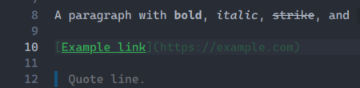
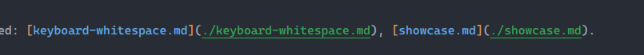

# Align link syntax colors to match editor theme (blue label, green path)

## Description
Inline markdown link highlighting does not match the desired editor link colors. Link label and URL should be styled like the reference screenshot, not as a single bright green underlined label with a dim URL.

## Steps
1. View a line with a markdown link such as `[Example link](https://example.com)` in the inline editor (line 10 in the first screenshot).
2. Compare to link styling on a line like `Related: [keyboard-whitespace.md](./keyboard-whitespace.md), [showcase.md](./showcase.md).` in the second screenshot.

## Expected
Link colors aligned to look more like the second image: tan/orange `[` `]` and `(` `)`, light blue link text inside brackets, green path inside parentheses with green underline.

## Actual
First image shows `[Example link]` in bright green with green underline; `(https://example.com)` is a darker muted green/grey, not the blue-label / green-path split from the reference.

## Evidence
- User: "align the color of links to look more like this" (first image = current, second = target)
- Image 1: line 10 `[Example link](https://example.com)` — label bright green underlined; URL dim olive-green
- Image 2: `Related: [keyboard-whitespace.md](./keyboard-whitespace.md), [showcase.md](./showcase.md).` — brackets/parens tan; labels light blue; paths green with green underline

## Images
- 
- 
