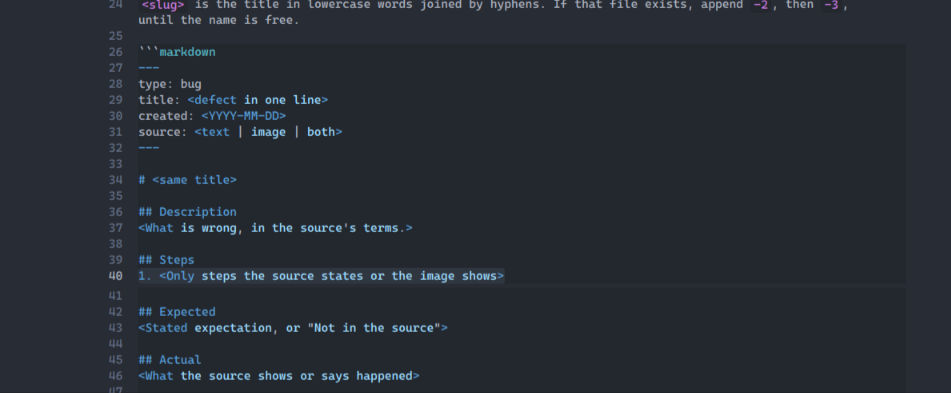

# Inside a markdown code block, "1." gets list styling and extra padding below

## Description
Inside a fenced `markdown` code block, a line that starts with `1.` is treated like an ordered-list marker instead of plain code text. The `1.` is highlighted (list styling), and extra vertical padding appears below that line.

## Steps
1. Open or edit a document that contains a fenced code block labeled `markdown` (as in the bug skill template).
2. Include a line under `## Steps` such as `1. <Only steps the source states or the image shows>` inside that code block.

## Expected
The `1.` should be escaped or otherwise rendered as literal text inside the code block, with normal line spacing and no list-item padding.

## Actual
The `1.` is styled as an ordered-list marker and there is visibly larger padding/gap below line 40 before the next line in the code block.

## Evidence
- User: "inside a markdown block the 1. is having a padding below it added … it should be escaped"
- Image: line 40 shows `1. <Only steps the source states or the image shows>` inside ```markdown; `1.` appears in list-marker styling; enlarged vertical gap below that line compared to adjacent lines in the same block.

## Images
- 
