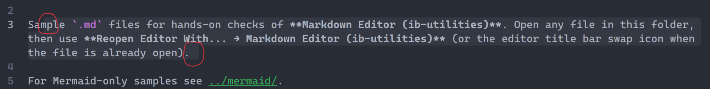

# Selections add an extra box at the start and the end

## Description
A selection adds an extra box at the start and at the end.
That extra box should not be there.

## Steps
1. Select the paragraph that starts with `Sample `.md` files for hands-on checks`.
2. The selection continues through `the file is already open).`

## Expected
A selection does not add an extra box at the start or the end.

## Actual
The selection shows an extra box at the start and a small extra box at the end.

## Evidence
- User: "selections are adding an extra box at the start and end of a selection it shouldnt be"
- Image: line 3 is selected from `Sample `.md` files` through `the file is already open).`
- Image: a red circle marks the start of that selection, before `Sample`.
- Image: a red circle marks a small dark box after the final period.

## Images
- 
