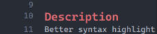

# Headings render the line gap at the top, related to the header font size

## Description
Headings render the line gap at the bottom when I want it on the top and more related to the font size of the header.

The gap applies to headings. Put the line gap on the top of the heading. Size that gap from the font size of the header.

The editor shows a dark theme with line numbers. Line 9 is empty. Line 10 is the heading `Description` in red. Line 11 is `Better syntax highlight` in white, directly under the heading.

## Done when
- Headings render the line gap at the top.
- The line gap is more related to the font size of the header.

## Images
- 
