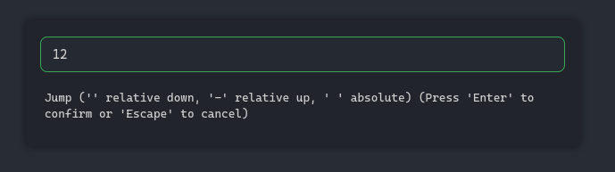
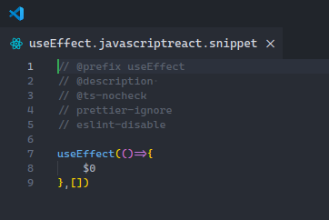
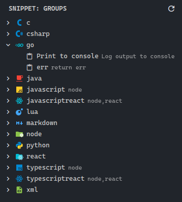
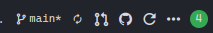
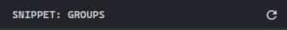

# IrishBruse's Utilities Contributions

A collection of utilities made by me

## Commands

### IB: Relative goto

-   **Command:** `ib-utilities.relativeGoTo`
-   **Short Title:** Relative goto

### IB: Open Snippet

-   **Command:** `ib-utilities.openSnippet`
-   **Short Title:** Open

### IB: Show Snippet View

-   **Command:** `ib-utilities.showSnippetView`
-   **Short Title:** Show Snippet View

### IB: Open Pull Request

-   **Command:** `ib-utilities.openPR`
-   **Short Title:** Open PR
-   **Icon:** $(github)

### IB: Refresh Snippets

-   **Command:** `ib-utilities.refreshSnippetView`
-   **Short Title:** Refresh
-   **Icon:** $(refresh)

## View Containers

### Snippet Manager

-   **ID:** `snippetContainer`
-   **Icon:** [media/snippet_icon.svg](media/snippet_icon.svg)

## Views

### Groups

-   **ID:** `snippetView`
-   **Container:** `snippetContainer`

## Configuration Properties

### LanguageIdMappings

Map snippet files to known language ID.
-   **Key:** `ib-utilities.languageIdMappings`

### GeneratedLanguageMappings

On the left is the languageId for the snippet to auto generate on the right is the comma delimited array of languages to build it from.
-   **Key:** `ib-utilities.generatedLanguageMappings`

## Menus

### Scm/title

- **Command:** `ib-utilities.openPR`
  - **Condition:** `scmProvider == git`
  - **Group:** `navigation`

### View/title

- **Command:** `ib-utilities.showSnippetView`
  - **Condition:** `view == snippetContainer`
  - **Group:** `navigation`

- **Command:** `ib-utilities.refreshSnippetView`
  - **Condition:** `view == snippetView`
  - **Group:** `navigation`

## Themes

### Empty Dark Theme

- **Name:** `Empty Dark Theme`
- **Base Theme:** `vs-dark`
