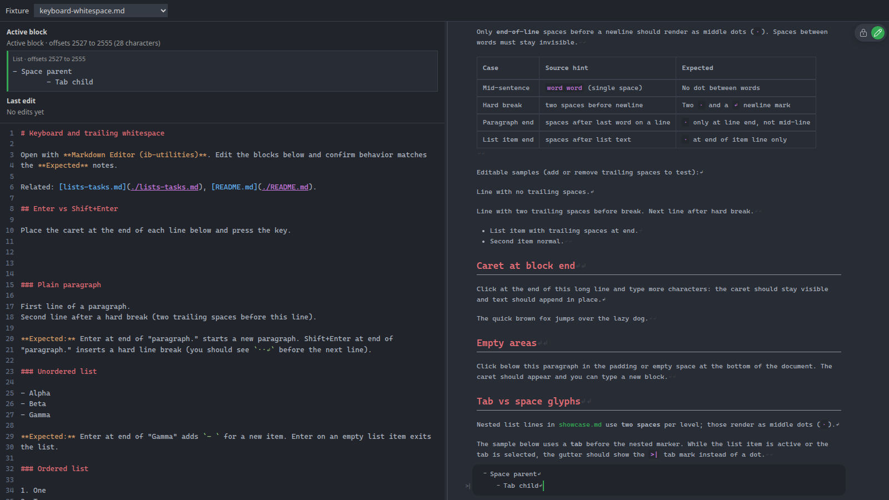
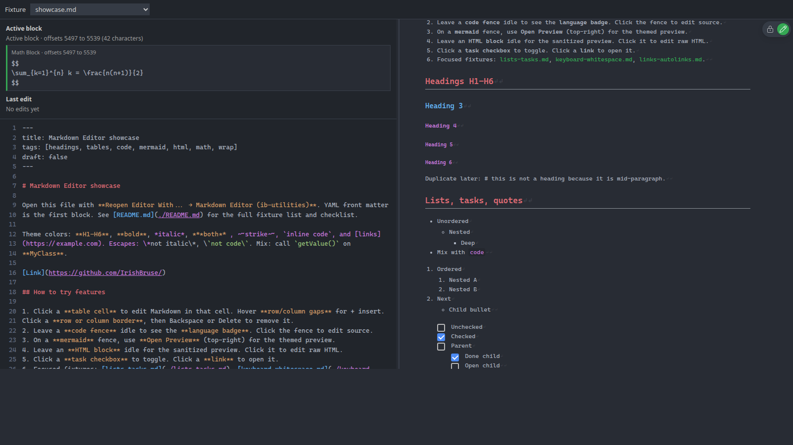

# Markdown Editor whitespace glyphs

The Markdown Editor can reveal invisible whitespace while you edit. Glyphs follow VS Code’s `editor.renderWhitespace` style: most mid-line whitespace stays hidden until it matters, but **spaces** and **tab characters** use different marks.

## Glyphs

| Source character | Glyph | When it appears |
| :--- | :--- | :--- |
| Space (` `) | Middle dot (`·`) | Trailing end-of-line spaces, mid-line whitespace in selections, block-indent glue, etc. |
| Tab (`\t`) | Arrow bar (`>\|`) | Same as spaces, plus any tab character in the source |
| List indent glue (active item) | Arrow bar (`>\|`) per source column | `md-glue-indent` on the line while the list item is active (spaces and tabs) |

Tab marks paint literal `>|` text (monospace), not the Unicode `⇥` symbol, because many editor fonts lack that glyph and fall back to a dot.

The webview uses `--ib-md-ws-glyph-color` (mixed from editor text) instead of raw `editorWhitespace.foreground`, which VS Code often sets with alpha and was rendering glyphs invisible.

## Nested lists in showcase.md

The **Lists, tasks, quotes** section in [showcase.md](../../tests/markdown/showcase.md) indents nested items with **two spaces per level** (standard GFM). While those list items are active (or their indent is selected), each indent column on the line shows **`>|`**, not `·`. `Nested` has two; `Deep` has four.

## Tab sample fixture

[keyboard-whitespace.md](../../tests/markdown/keyboard-whitespace.md) ends with a **Tab vs space glyphs** section:

- `Space parent` uses only spaces.
- `Tab child` uses a **tab** before `-`.

Click **Tab child** (or select the tab). The list gutter should show the `>\|` mark on the tab stop, not a middle dot.

## Playground proof

With `npm run dev:markdown-editor`, open `keyboard-whitespace.md`, scroll to **Tab vs space glyphs**, and activate **Tab child**. The gutter should match the screenshot below.

Space-indented nested items in showcase (two spaces per level) still show middle dots:

## Implementation notes

- Base styles: `packages/markdown-editor/src/view/editor.css` (`--md-tab-glyph-mask`, `.md-ws-tab`).
- Webview overrides: `webview/markdownEditor.css` (hide most glyphs; paint `·` / `>\|` for EOL, selection, active blocks, and list gutters).
- Classification: `blockView.ts` (`md-ws-space` vs `md-ws-tab`); `webview/eolWhitespace.ts` (EOL / selection overlays).
