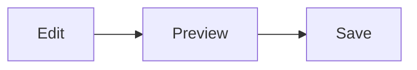

# Fenced code blocks

Language badge shows on inactive blocks. Click a block to edit the fence source.

## TypeScript

```typescript
export function greet(name: string): string {
	return `Hello, ${name}!`;
}

console.log(greet("world"));
```

## JavaScript

```javascript
function add(a, b) {
	return a + b;
}
```

## Python

```python
def fib(n: int) -> list[int]:
    a, b = 0, 1
    out = []
    for _ in range(n):
        out.append(a)
        a, b = b, a + b
    return out
```

## JSON

```json
{
  "name": "ib-utilities",
  "version": "0.19.0",
  "private": true
}
```

## CSS

```css
.md-theme-vscode-default h1.md-heading {
	color: var(--ib-md-heading-1, #d19a66);
}
```

## Shell

```bash
npm run build-markdown-editor
npm run verify
```

## Gherkin

```gherkin
Feature: Markdown editor
  Scenario: Open a table cell
    Given a markdown table
    When I click a cell
    Then a nested editor opens
```

## Mermaid



## No language

```
plain fence without a language tag
line two
```

## Empty fence

```typescript
```
