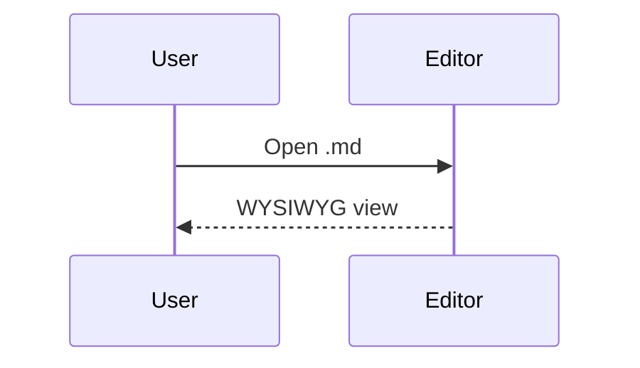

# Kitchen sink

Front matter above. Mixed constructs below for a full pass in the editor.

## Inline and lists

Write **bold**, *italic*, `code`, and a [link](https://example.com).

1. Ordered
2. With a task:
   - [x] Done
   - [ ] Todo

## Table

| Col A | Col B |
| ----- | ----- |
| alpha | `code` |
| **bold** | [link](./04-tables.md) |

## Code

```typescript
type Point = { x: number; y: number };
const origin: Point = { x: 0, y: 0 };
```

## Mermaid



## HTML

<aside>
  <p>HTML aside block for preview.</p>
</aside>

## Quote and rule

> Sink file quote.

---

## Math

Inline $a^2 + b^2 = c^2$ and a block:

$$
\sum_{k=1}^{n} k = \frac{n(n+1)}{2}
$$
