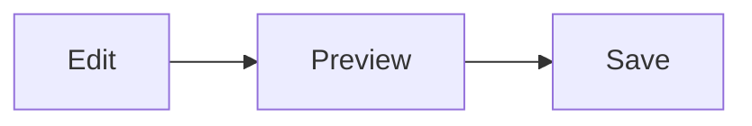
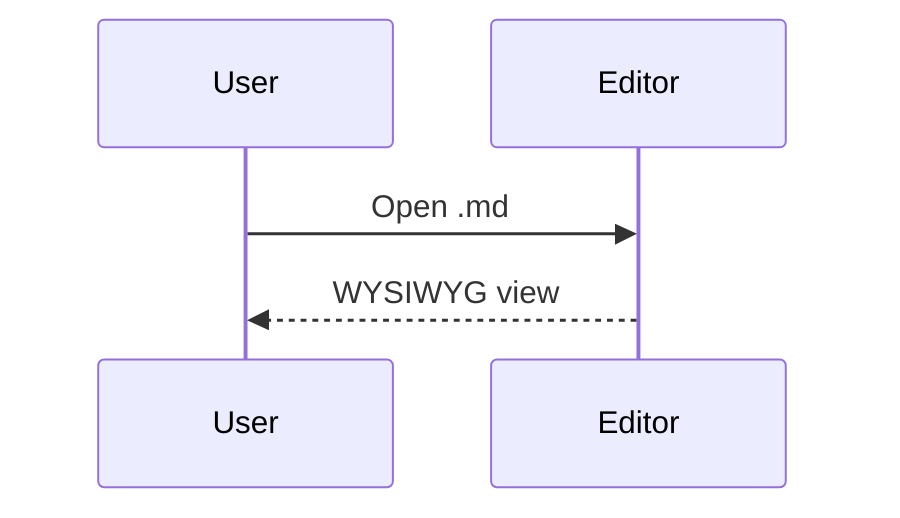

# Markdown Editor showcase

Open this file with **Reopen Editor With... → Markdown Editor (ib-utilities)**. YAML front matter is the first block.

Theme colors: **H1–H6**, **bold**, *italic*, ***both***, ~~strike~~, `inline code`, and [links](https://example.com). Escapes: \*not italic\*, \`not code\`. Mix: call `getValue()` on **MyClass**.

[Link](https://github.com/IrishBruse/)

## How to try features

1. Click a **table cell** to edit Markdown in that cell. Hover **row/column gaps** for + insert. Click a **row or column border**, then Backspace or Delete to remove it.
2. Leave a **code fence** idle to see the **language badge**. Click the fence to edit source.
3. On a **mermaid** fence, use **Open Preview** (top-right) for the themed preview.
4. Leave an **HTML block** idle for the sanitized preview. Click it to edit raw HTML.
5. Click a **task checkbox** to toggle. Click a **link** to open it.

## Headings H1–H6

### Heading 3

#### Heading 4

##### Heading 5

###### Heading 6

Duplicate later: # this is not a heading because it is mid-paragraph.

## Lists, tasks, quotes

- Unordered
  - Nested
    - Deep
- Mix with `code`

1. Ordered
   1. Nested A
   2. Nested B
2. Next
   - Child bullet

- [ ] Unchecked
- [x] Checked
- [ ] Parent
  - [x] Done child
  - [ ] Open child

> Quote with **bold**, *italic*, and `code`.
>
> > Nested quote
>
> - List in a quote

Above a rule.

---

Below a rule.

## Tables (grid)

Click a cell. Cells accept Markdown. Wide text wraps when `markdownInlineEditor.tables.style` is `wrapped`.

| Name | Role | Notes |
| :--- | :---: | ---: |
| Ada | **Engineer** | `inline` and a [link](https://example.com) |
| Grace | Architect | Long description that should wrap instead of stretching the column forever |
| Alan | Researcher | Empty next → |
| | | |

| Left | Center | Right |
| :--- | :----: | ----: |
| a | b | 1 |
| longer left | mid | 999 |

| Only |
| ---- |
| one |
| two |

## Code fences and language badges

Idle blocks show a language label. Highlighting follows the active color theme. Plain editor foreground (not yellow) for untokenized text.

```typescript
export function greet(name: string): string {
	return `Hello, ${name}!`;
}
console.log(greet("world"));
```

```javascript
function add(a, b) {
	return a + b;
}
```

```python
def fib(n: int) -> list[int]:
    a, b = 0, 1
    out = []
    for _ in range(n):
        out.append(a)
        a, b = b, a + b
    return out
```

```json
{ "name": "ib-utilities", "private": true }
```

```css
.md-theme-vscode-default h1.md-heading {
	color: var(--ib-md-heading-1, #d19a66);
}
```

```bash
npm run build-markdown-editor
```

```gherkin
Feature: Markdown editor
  Scenario: Edit a table cell
    Given a markdown table
    When I click a cell
    Then a nested editor opens
```

```
plain fence without a language tag
```

```typescript
```

## Mermaid (Open Preview)

Idle mermaid fences show **Open Preview** instead of a language badge. The diagram also renders in the block.





Relative mermaid file: [call_graph.mmd](../mermaid/call_graph.mmd). Markdown mermaid sample: [test.md](../mermaid/test.md).

## HTML preview

Idle HTML is sanitized and painted. Click to edit source. `script` / `iframe` / `style` are stripped.

<div class="note">
  <strong>Note:</strong> HTML preview for inactive blocks. <a href="https://example.com">Link in HTML</a>.
</div>

<section>
  <h3>HTML heading</h3>
  <p>Paragraph with <em>emphasis</em>, <mark>mark</mark>, <kbd>Ctrl</kbd>+<kbd>S</kbd>.</p>
  <ul>
    <li>One</li>
    <li>Two</li>
  </ul>
</section>

<details>
  <summary>Expand me</summary>
  <p>Hidden details content.</p>
</details>

<script>alert("should not run")</script>
<iframe src="https://example.com"></iframe>

Inline HTML in a sentence: <span>colored span</span> and <br> a break.

## Links, images, math

- [Example](https://example.com "Example title")
- [Headings in this file](#headings-h1h6)
- [Relative](./edge-cases.md)
- Autolink: https://example.com/path?q=1
- <https://example.com>
- Reference: [same ref twice][ref] and [again][ref]

[ref]: https://example.com/ref "Reference"


Inline math: $E = mc^2$ and $x = \frac{-b \pm \sqrt{b^2-4ac}}{2a}$.

$$
\int_{-\infty}^{\infty} e^{-x^2} \, dx = \sqrt{\pi}
$$

$$
\sum_{k=1}^{n} k = \frac{n(n+1)}{2}
$$
