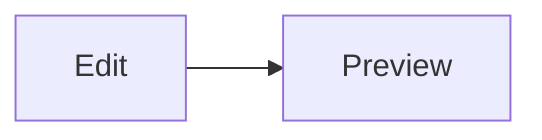

# Hello

A paragraph with **bold**, *italic*, ~~strike~~, and `inline code`.

[Example link](https://example.com)

> Quote line.

---


- [ ] Task

```ts
const value = 1;
```



| Case | Source hint | Expected |
| :--- | :--- | :--- |
| Mid-sentence | `word word` (single space) | No dot between words |

- Wrapped list item that keeps going so the continuation line sits under the words instead of under the marker.
