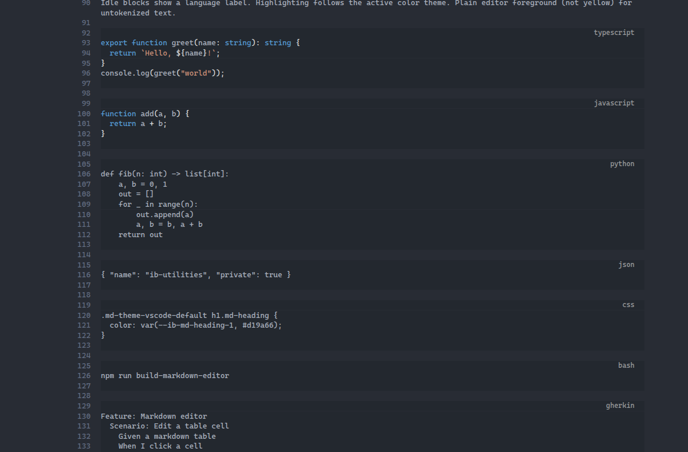

# Features

- [ ]  When dragging a selection on a line for some markdown stuff it reveals the raw for stuff not touching the selection/cursor
- [ ] todo

## 1

Implement rendering of

  
Expand me

  
Hidden details content.

<section>
  <h3>HTML heading</h3>
  
Paragraph with <em>emphasis</em>, <mark>mark</mark>, <kbd>Ctrl</kbd>+<kbd>S</kbd>.

  <ul>
    <li>One</li>
    <li>Two</li>
  </ul>
</section>

  <strong>Note:</strong> HTML preview for inactive blocks. <a href="https://example.com">Link in HTML</a>.

## 2

better syntax highlight common langauges

- json
- js/ts family
- bash
- css
- html
- python
- gherkins

